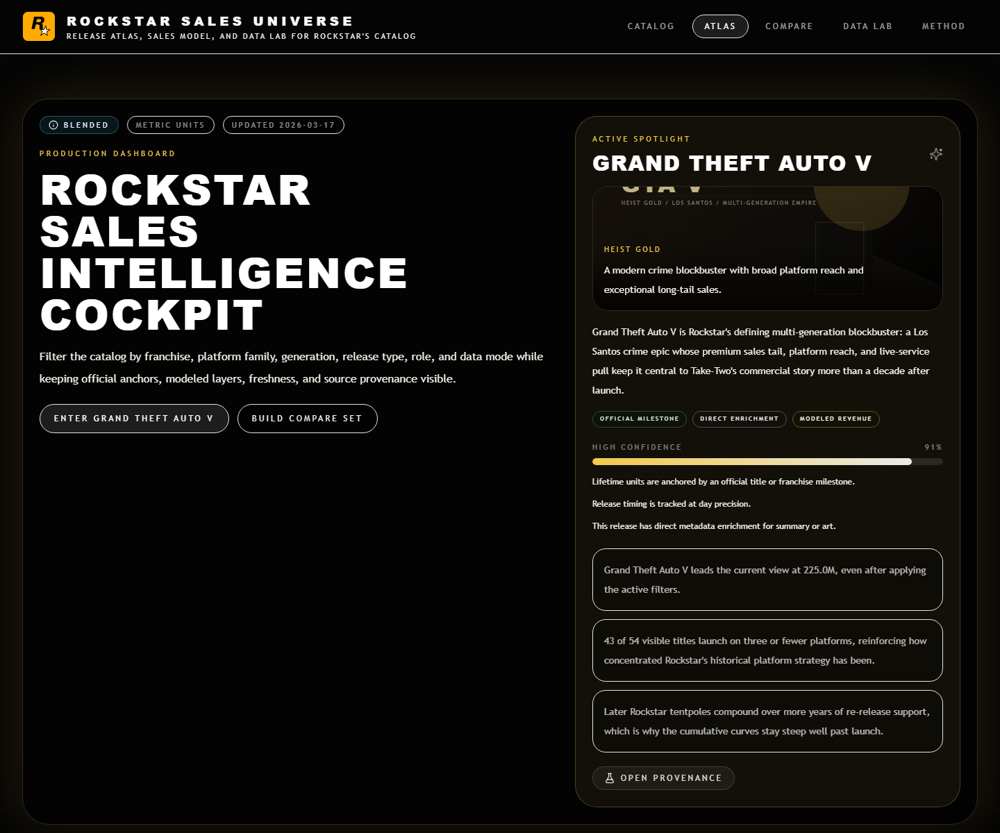
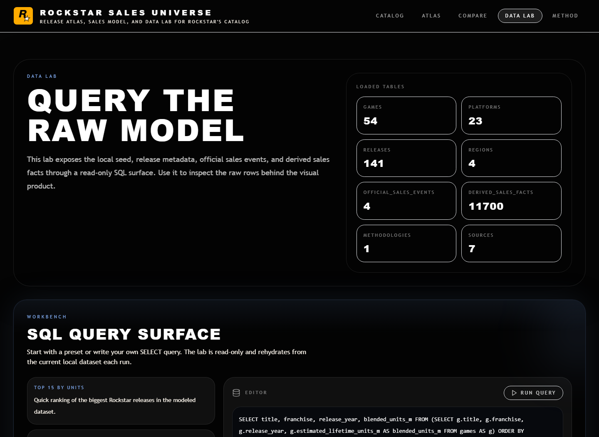

# ROCKSTAR SALES UNIVERSE

`ROCKSTAR SALES UNIVERSE` is a Next.js project I built around Rockstar Games' release history, sales estimates, platform breakdowns, release timelines, and a browser-based SQL lab.

The main thing I wanted was for it to feel like an actual product, not just a spreadsheet with charts dropped into a dark theme.


## What This Is

This repo is a multi-surface Rockstar explorer with a few different ways to move through the same dataset:

- a homepage that acts like a front door into the whole project
- a catalog explorer with search and quick filters
- themed title pages with platform and release context
- a compare mode for head-to-head game breakdowns
- a SQL data lab for looking at the raw tables directly
- a methodology page that keeps the confidence and modeling rules visible

## What The Current Build Does

### 1. Full Rockstar release catalog

The catalog is not only the obvious blockbuster games.

It includes:

- mainline releases
- mission packs
- expansions
- online layers
- re-releases and variants

That matters because `GTA V`, `GTA Online`, `Undead Nightmare`, and `Bully: Scholarship Edition` should not all be flattened into the same type of entry.

### 2. Real cover art and richer title metadata

The app now pulls cover art and short metadata through [`scripts/fetch-metadata.ts`](./scripts/fetch-metadata.ts), then stores that enrichment in [`data/raw/game-enrichment.json`](./data/raw/game-enrichment.json).

That gives the catalog:

- actual cover art for the long tail
- better short summaries on cards
- stronger fallback behavior for variants and related releases

### 3. Homepage that feels interactive

The homepage is no longer just a static intro block.

It now includes:

- an art-backed hero
- a browsable `Active World` panel
- a GTA VI forecast section with official Rockstar artwork
- a horizontal release timeline that shows covers and modeled revenue
- direct jump-off points into the rest of the app

### 4. Clear data honesty

I wanted the app to stay explicit about what is official and what is modeled.

The project separates:

- `Confirmed`
- `Estimated`
- `Blended`

So the UI can stay ambitious without pretending every number is equally real.

## Product Surfaces

### Homepage

The homepage is the quickest way to understand the project. It lets you browse the catalog, flip through featured worlds, scan revenue context, and jump into deeper pages.

### Dashboard

The dashboard is the broadest analytics view. It is where the full catalog can be sliced by franchise, platform family, generation, role, and release type.



### Game Pages

Each title page is treated more like its own little world than a generic template. That includes key art, logo treatment, platform cards, timeline context, and provenance.

### Compare Mode

Compare mode is for building a short slate and seeing how those games stack up against each other in a cleaner head-to-head format.


### Data Lab

The SQL lab is there because I did not want polished charts to be the only way someone could inspect the project. You can query the local tables directly in-browser.



## Tech Stack

- Next.js 16 App Router
- TypeScript
- Tailwind CSS
- Framer Motion
- Recharts
- AlaSQL
- local normalized seed data plus derived fact tables

## Project Structure

```text
app/
  page.tsx
  dashboard/page.tsx
  compare/page.tsx
  data-lab/page.tsx
  game/[slug]/page.tsx
  methodology/page.tsx
components/
  cards/
  charts/
  compare/
  dashboard/
  data-lab/
  game/
  layout/
  ui/
config/
data/
  raw/
  normalized/
docs/
  screenshots/
lib/
  data/
  formatters/
  metrics/
  themes/
scripts/
types/
```

## Data Model

Typed domain entities live in [`types/domain.ts`](./types/domain.ts).

The main ones are:

- `Game`
- `Platform`
- `Release`
- `OfficialSalesEvent`
- `DerivedSalesFact`
- `Methodology`
- `SourceRecord`
- `GameEnrichment`

The fields that matter most to the shape of the app are things like `kind`, `rockstarRole`, `analyticsCoverage`, and `releaseDatePrecision`.

## Data Flow

The current build is still seed-first, but the structure is set up so the source layer can grow later.

Current flow:

1. raw references and metadata live under [`data/raw`](./data/raw)
2. normalized catalog entities live under [`data/normalized`](./data/normalized)
3. repository helpers shape the product layer
4. presenter utilities turn the data into card-ready and chart-ready views
5. the SQL lab exposes the table layer directly

Useful scripts:

- `npm run data:fetch`
- `npm run data:normalize`
- `npm run data:derived`
- `npm run data:ingest`
- `npm run data:validate`
- `npm run data:official-anchors`
- `npm run audit:queue`
- `npm run audit:strict-blocker`
- `npm run audit:health`
- `npm run audit:enrichment-dry-run`
- `npm run release:verify`
- `npm run release:verify:strict`
- `npm run app:verify`
- `npm run app:visual`
- `npm run docs:screenshots`
- `npm run dev`
- `npm run build`

For production setup, database import, and interview-demo readiness, see [`docs/PRODUCTION_RUNBOOK.md`](./docs/PRODUCTION_RUNBOOK.md).

## Production Readiness

The project is set up for a Supabase Postgres backend, but it still runs locally without a database through the seed-data fallback.

Current production status:

- Drizzle schema and migration files are in place.
- Import and smoke-test scripts are in place.
- `/api/health` checks real database connectivity when `DATABASE_URL` is configured.
- `npm run release:verify` runs the standard local release gate.
- `npm run release:verify:strict` is the final gate after Supabase is connected.
- The remaining external blocker is a real Supabase `DATABASE_URL` so `db:push`, `db:import`, `db:smoke`, and strict readiness can run against the production database.

Before calling the project full-stack complete, I would run:

```bash
npm run db:push
npm run db:import
npm run db:smoke
npm run audit:readiness:strict
npm run release:verify:strict
```

## Modeling Approach

Not every Rockstar release has a public title-level sales milestone, so the app uses a lower-confidence model where direct disclosure stops.

That modeled layer takes into account:

- release year
- release type
- platform footprint
- franchise strength
- Rockstar's role on the title
- inheritance from parent titles for expansions, mission packs, variants, and online layers

What I am not claiming:

- exact historical sell-through by platform
- official revenue reporting
- fake precision on old catalog titles with weak source coverage

## Running Locally

Install dependencies and start the app:

```bash
npm install
npm run dev
```

For a production build:

```bash
npm run build
npm run start
```

Type check:

```bash
npm run lint
```

Note: `npm run lint` currently runs `tsc --noEmit`.

Also, do not run `npm run build` while a dev server is already running against the same workspace. Both commands write to `.next`, and on Windows that can blow up the dev server cache.

## Interview Demo Path

If I were walking someone through the project in an interview, I would not start with the code. I would show the product first, then back into the technical choices.

1. Start on the homepage and use the `Active World` panel to show that this is an interactive catalog, not a static landing page.
2. Open the dashboard and switch between `Overview`, `Sources`, and `Model Audit` to show the trust layer, official anchors, and modeled boundaries.
3. Use a preset like `GTA vs Red Dead` or `Official anchors only` to show that the dashboard state is shareable through the URL.
4. Open `Grand Theft Auto V` or `Red Dead Redemption 2` and point out the release context, field provenance, confidence reasons, and title-level presentation.
5. Open compare mode and build a short matchup so the app feels like a tool instead of just a report.
6. End in the Data Lab or source review page to show that the polished UI still has an inspectable data layer behind it.

The main talking point is that official Take-Two/Rockstar disclosures are treated as anchors, while undisclosed title/platform/region details are clearly marked as modeled. That is the difference between making a flashy chart and making a defensible data product.

## Why I Built It

This project let me combine a few things I actually care about in one repo:

- frontend presentation
- product framing
- data modeling
- source transparency
- themed UI systems instead of one-off pages

I wanted something that could still feel cinematic and opinionated without hiding the uncertainty in the data.

## Roadmap

This is not the final state of the project.

If I were treating the next phase more like a serious product roadmap instead of a loose wishlist, this is where I would push it:

### 1. Data quality and catalog depth

- improve long-tail cover art and metadata quality so older and lower-visibility titles feel less like second-class entries
- add tighter release-specific context for legacy games, including better release dates, platform notes, and edition lineage
- expand enrichment beyond short summaries into developer history, release context, and notable production facts
- tighten title matching and fallback logic in the metadata pipeline so edge-case releases need less manual cleanup

### 2. Provenance and trust layer

- surface sources more aggressively in the UI instead of keeping most of the trust model tucked into methodology and drawers
- show which fields are official, inferred, inherited, or modeled at the component level
- make confidence easier to understand by tying it to visible reasons instead of only a score
- add clearer source trails for covers, metadata, revenue assumptions, and release chronology

### 3. Product and interaction improvements

- keep making the homepage feel more alive with stronger transitions, richer title switching, and better world-to-world navigation
- expand compare mode into something more shareable with saved presets, deep links, and clearer matchup summaries
- add more title-specific detail modules so older games have stronger identity instead of relying mostly on the shared system
- improve mobile presentation for the densest surfaces so the app still feels intentional on smaller screens

### 4. Performance, accessibility, and technical polish

- reduce dashboard and heavy route cost further through more aggressive code-splitting and asset discipline
- audit image delivery, caching behavior, and large-art loading so the visual side stays strong without dragging the app down
- improve keyboard navigation, contrast checks, semantics, and screen-reader clarity across interactive areas
- treat Core Web Vitals, bundle size, and route-level rendering behavior as first-class product quality concerns

### 5. SEO and discoverability

- add stronger metadata, social cards, and route-specific descriptions for the major app surfaces
- improve structured page content so title pages and methodology pages are more indexable and easier to understand at a glance
- make the project easier to share externally with cleaner screenshots, richer README documentation, and better route previews

### 6. Platform and backend evolution

- move to a persistent backend if the dataset grows beyond what local seed files handle comfortably
- separate raw ingestion, normalized entities, derived facts, and presentation data more cleanly for future updates
- add admin-style workflows for source updates and enrichment review if the project becomes a living dataset
- preserve the current product layer so frontend components stay mostly data-source agnostic during that transition
