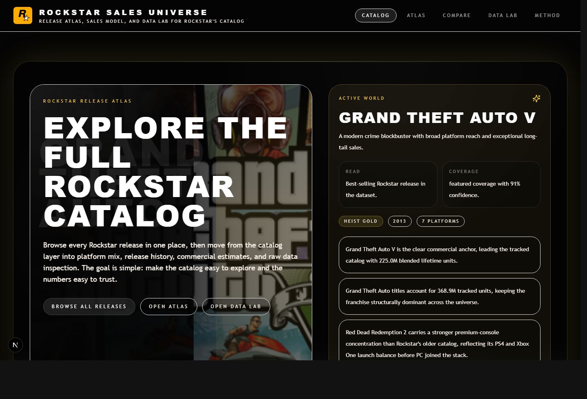
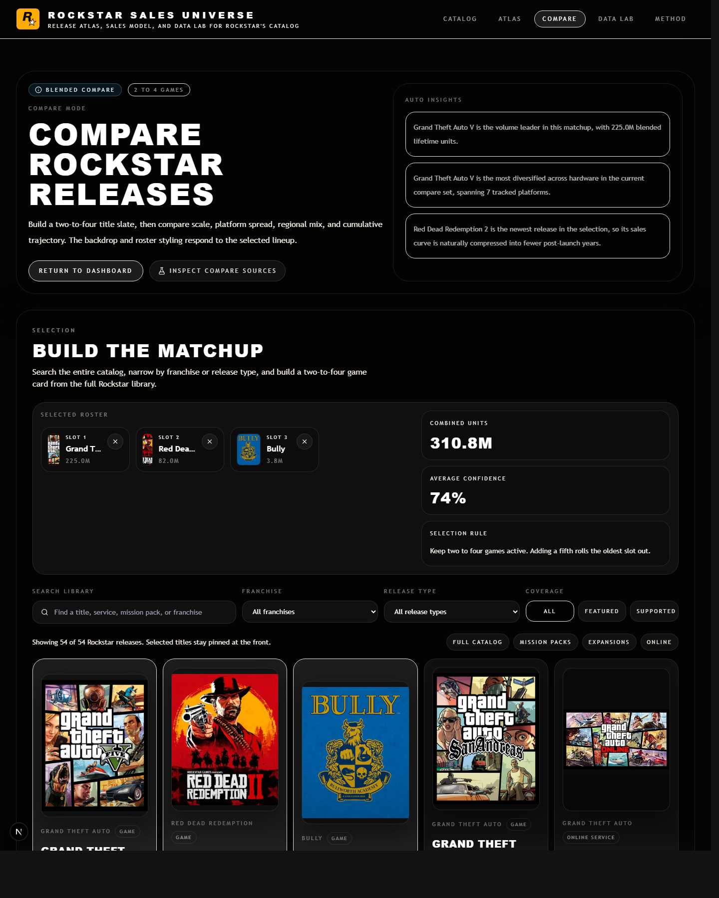

# ROCKSTAR SALES UNIVERSE

`ROCKSTAR SALES UNIVERSE` is a Next.js project I built around Rockstar Games' release history, sales estimates, platform breakdowns, release timelines, and a browser-based SQL lab.

The main thing I wanted was for it to feel like an actual product, not just a spreadsheet with charts dropped into a dark theme.



## What This Is

This repo is a multi-surface Rockstar explorer with a few different ways to move through the same dataset:

- a homepage that acts like a front door into the whole project
- a catalog explorer with search and quick filters
- themed title pages with platform and release context
- a compare mode for head-to-head game breakdowns
- a SQL data lab for looking at the raw tables directly
- a methodology page that keeps the confidence and modeling rules visible

## What The Current Build Does

### 1. Full Rockstar release catalog

The catalog is not only the obvious blockbuster games.

It includes:

- mainline releases
- mission packs
- expansions
- online layers
- re-releases and variants

That matters because `GTA V`, `GTA Online`, `Undead Nightmare`, and `Bully: Scholarship Edition` should not all be flattened into the same type of entry.

### 2. Real cover art and richer title metadata

The app now pulls cover art and short metadata through [`scripts/fetch-metadata.ts`](./scripts/fetch-metadata.ts), then stores that enrichment in [`data/raw/game-enrichment.json`](./data/raw/game-enrichment.json).

That gives the catalog:

- actual cover art for the long tail
- better short summaries on cards
- stronger fallback behavior for variants and related releases

### 3. Homepage that feels interactive

The homepage is no longer just a static intro block.

It now includes:

- an art-backed hero
- a browsable `Active World` panel
- a GTA VI forecast section with official Rockstar artwork
- a horizontal release timeline that shows covers and modeled revenue
- direct jump-off points into the rest of the app

### 4. Clear data honesty

I wanted the app to stay explicit about what is official and what is modeled.

The project separates:

- `Confirmed`
- `Estimated`
- `Blended`

So the UI can stay ambitious without pretending every number is equally real.

## Product Surfaces

### Homepage

The homepage is the quickest way to understand the project. It lets you browse the catalog, flip through featured worlds, scan revenue context, and jump into deeper pages.

### Dashboard

The dashboard is the broadest analytics view. It is where the full catalog can be sliced by franchise, platform family, generation, role, and release type.

### Game Pages

Each title page is treated more like its own little world than a generic template. That includes key art, logo treatment, platform cards, timeline context, and provenance.

### Compare Mode

Compare mode is for building a short slate and seeing how those games stack up against each other in a cleaner head-to-head format.



### Data Lab

The SQL lab is there because I did not want polished charts to be the only way someone could inspect the project. You can query the local tables directly in-browser.

## Tech Stack

- Next.js App Router
- TypeScript
- Tailwind CSS
- Framer Motion
- Recharts
- AlaSQL
- local normalized seed data plus derived fact tables

## Project Structure

```text
app/
  page.tsx
  dashboard/page.tsx
  compare/page.tsx
  data-lab/page.tsx
  game/[slug]/page.tsx
  methodology/page.tsx
components/
  cards/
  charts/
  compare/
  dashboard/
  data-lab/
  game/
  layout/
  ui/
config/
data/
  raw/
  normalized/
docs/
  screenshots/
lib/
  data/
  formatters/
  metrics/
  themes/
scripts/
types/
```

## Data Model

Typed domain entities live in [`types/domain.ts`](./types/domain.ts).

The main ones are:

- `Game`
- `Platform`
- `Release`
- `OfficialSalesEvent`
- `DerivedSalesFact`
- `Methodology`
- `SourceRecord`
- `GameEnrichment`

The fields that matter most to the shape of the app are things like `kind`, `rockstarRole`, `analyticsCoverage`, and `releaseDatePrecision`.

## Data Flow

The current build is still seed-first, but the structure is set up so the source layer can grow later.

Current flow:

1. raw references and metadata live under [`data/raw`](./data/raw)
2. normalized catalog entities live under [`data/normalized`](./data/normalized)
3. repository helpers shape the product layer
4. presenter utilities turn the data into card-ready and chart-ready views
5. the SQL lab exposes the table layer directly

Useful scripts:

- `npm run data:fetch`
- `npm run data:normalize`
- `npm run data:derived`
- `npm run dev`
- `npm run build`

## Modeling Approach

Not every Rockstar release has a public title-level sales milestone, so the app uses a lower-confidence model where direct disclosure stops.

That modeled layer takes into account:

- release year
- release type
- platform footprint
- franchise strength
- Rockstar's role on the title
- inheritance from parent titles for expansions, mission packs, variants, and online layers

What I am not claiming:

- exact historical sell-through by platform
- official revenue reporting
- fake precision on old catalog titles with weak source coverage

## Running Locally

Install dependencies and start the app:

```bash
npm install
npm run dev
```

For a production build:

```bash
npm run build
npm run start
```

Type check:

```bash
npm run lint
```

Note: `npm run lint` currently runs `tsc --noEmit`.

Also, do not run `npm run build` while a dev server is already running against the same workspace. Both commands write to `.next`, and on Windows that can blow up the dev server cache.

## Why I Built It

This project let me combine a few things I actually care about in one repo:

- frontend presentation
- product framing
- data modeling
- source transparency
- themed UI systems instead of one-off pages

I wanted something that could still feel cinematic and opinionated without hiding the uncertainty in the data.

## Roadmap

- improve long-tail metadata and cover quality even more
- add more release-specific context to older titles
- expand provenance and source surfacing in the UI
- make compare mode and dashboard states more shareable
- move the project onto a persistent backend later if the dataset grows
